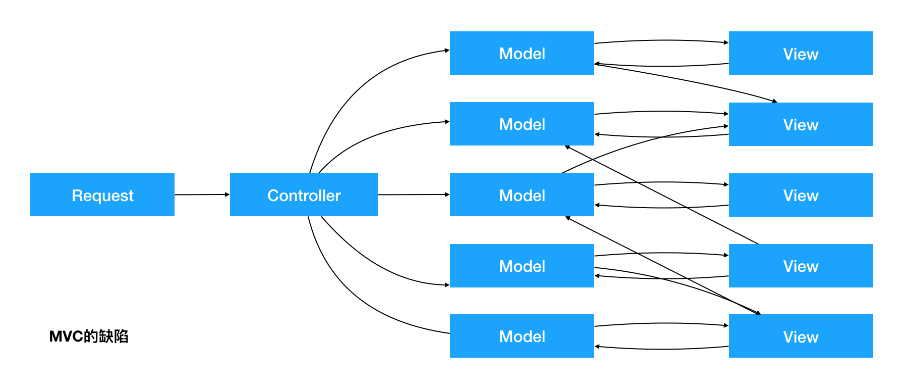
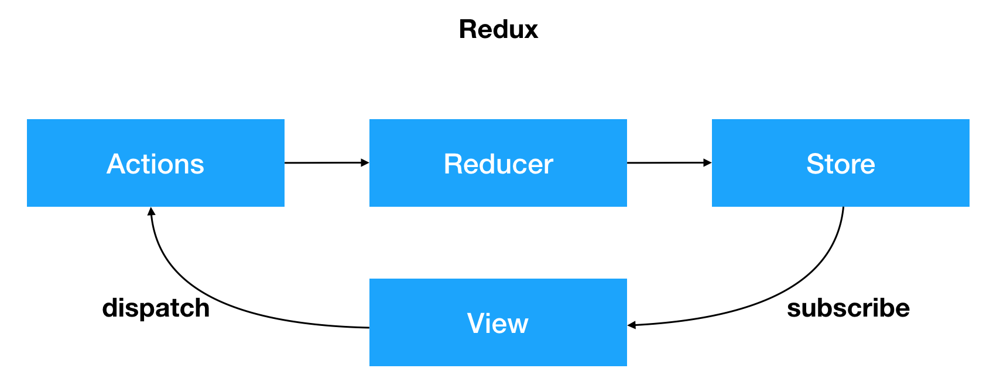

# 状态管理

## 传统MVC框架的缺陷

**什么是MVC？**


`MVC`的全名是`Model View Controller`，是模型(model)－视图(view)－控制器(controller)的缩写，是一种软件设计典范。

`V`即View视图是指用户看到并与之交互的界面。

`M`即Model模型是管理数据 ，很多业务逻辑都在模型中完成。在MVC的三个部件中，模型拥有最多的处理任务。

`C`即Controller控制器是指控制器接受用户的输入并调用模型和视图去完成用户的需求，控制器本身不输出任何东西和做任何处理。它只是接收请求并决定调用哪个模型构件去处理请求，然后再确定用哪个视图来显示返回的数据。

**MVC只是看起来很美**

MVC框架的数据流很理想，请求先到Controller, 由Controller调用Model中的数据交给View进行渲染，但是在实际的项目中，又是允许Model和View直接通信的。然后就出现了这样的结果：



## Flux

在2013年，Facebook让`React`亮相的同时推出了Flux框架，`React`的初衷实际上是用来替代`jQuery`的，`Flux`实际上就可以用来替代`Backbone.js`，`Ember.js`等一系列`MVC`架构的前端JS框架。

其实`Flux`在`React`里的应用就类似于`Vue`中的`Vuex`的作用，但是在`Vue`中，`Vue`是完整的`mvvm`框架，而`Vuex`只是一个全局的插件。

`React`只是一个MVC中的V(视图层)，只管页面中的渲染，一旦有数据管理的时候，`React`本身的能力就不足以支撑复杂组件结构的项目，在传统的`MVC`中，就需要用到Model和Controller。Facebook对于当时世面上的`MVC`框架并不满意，于是就有了`Flux`, 但`Flux`并不是一个`MVC`框架，他是一种新的思想。


- View： 视图层
- ActionCreator（动作创造者）：视图层发出的消息（比如mouseClick）
- Dispatcher（派发器）：用来接收Actions、执行回调函数
- Store（数据层）：用来存放应用的状态，一旦发生变动，就提醒Views要更新页面

Flux的流程：

1. 组件获取到store中保存的数据挂载在自己的状态上
2. 用户产生了操作，调用actions的方法
3. actions接收到了用户的操作，进行一系列的逻辑代码、异步操作
4. 然后actions会创建出对应的action，action带有标识性的属性
5. actions调用dispatcher的dispatch方法将action传递给dispatcher
6. dispatcher接收到action并根据标识信息判断之后，调用store的更改数据的方法
7. store的方法被调用后，更改状态，并触发自己的某一个事件
8. store更改状态后事件被触发，该事件的处理程序会通知view去获取最新的数据

## Redux

React 只是 DOM 的一个抽象层，并不是 Web 应用的完整解决方案。有两个方面，它没涉及。

- 代码结构 
- 组件之间的通信

2013年 Facebook 提出了 Flux 架构的思想，引发了很多的实现。2015年，Redux 出现，将 Flux 与[函数式编程](<https://llh911001.gitbooks.io/mostly-adequate-guide-chinese/content/>)结合一起，很短时间内就成为了最热门的前端架构。

如果你不知道是否需要 Redux，那就是不需要它

只有遇到 React 实在解决不了的问题，你才需要 Redux

简单说，如果你的UI层非常简单，没有很多互动，Redux 就是不必要的，用了反而增加复杂性。

- 用户的使用方式非常简单
- 用户之间没有协作
- 不需要与服务器大量交互，也没有使用 WebSocket
- 视图层（View）只从单一来源获取数据

**需要使用Redux的项目:**

- 用户的使用方式复杂
- 不同身份的用户有不同的使用方式（比如普通用户和管理员）
- 多个用户之间可以协作
- 与服务器大量交互，或者使用了WebSocket
- View要从多个来源获取数据

**从组件层面考虑，什么样子的需要Redux：**

- 某个组件的状态，需要共享
- 某个状态需要在任何地方都可以拿到
- 一个组件需要改变全局状态
- 一个组件需要改变另一个组件的状态

**Redux的设计思想：**

1. Web 应用是一个状态机，视图与状态是一一对应的。
2. 所有的状态，保存在一个对象里面（唯一数据源）。

> 注意：flux、redux都不是必须和react搭配使用的，因为flux和redux是完整的架构，在学习react的时候，只是将react的组件作为redux中的视图层去使用了。

**Redux的使用的三大原则：**

- Single Source of Truth(唯一的数据源)
- State is read-only(状态是只读的)
- Changes are made with pure function(数据的改变必须通过纯函数完成)

### 自己实现Redux

这个部分，可以根据班级情况看是否讲解。对于学生使用redux有很大的帮助。不使用react，直接使用原生的html/js来写一个简易的的redux

基本的状态管理及数据渲染

```html
<!DOCTYPE html>
<html lang="en">
<head>
  <meta charset="UTF-8">
  <meta name="viewport" content="width=device-width, initial-scale=1.0">
  <meta http-equiv="X-UA-Compatible" content="ie=edge">
  <title>Redux principle 01</title>
</head>
<body>
  <h1>redux principle</h1>
  <div class="counter">
    <span class="btn" onclick="dispatch({type: 'COUNT_DECREMENT', number: 10})">-</span>
    <span class="count" id="count"></span>
    <span class="btn" id="add" onclick="dispatch({type: 'COUNT_INCREMENT', number: 10})">+</span>
  </div>
  <script>
    // 定义一个计数器的状态
    const countState = {
      count: 10
    }

    // 定一个方法叫changeState，用于处理state的数据，每次都返回一个新的状态
    const changeState = (action) => {
      switch(action.type) {
        // 处理减
        case 'COUNT_DECREMENT':
          countState.count -= action.number
          break;
        // 处理加        
        case 'COUNT_INCREMENT':
          countState.count += action.number
          break;
        default:
          break;
      }
    }

    // 定义一个方法用于渲染计数器的dom
    const renderCount = (state) => {
      const countDom = document.querySelector('#count')
      countDom.innerHTML = state.count
    }
  
    // 首次渲染数据
    renderCount(countState)

    // 定义一个dispatch的方法，接收到动作之后，自动调用
    const dispatch = (action) => {
      changeState(action)
      renderCount(countState)
    }

  </script>
</body>
</html>
```

创建createStore方法

```html
<!DOCTYPE html>
<html lang="en">
<head>
  <meta charset="UTF-8">
  <meta name="viewport" content="width=device-width, initial-scale=1.0">
  <meta http-equiv="X-UA-Compatible" content="ie=edge">
  <title>Redux principle 02</title>
</head>
<body>
  <h1>redux principle</h1>
  <div class="counter">
    <span class="btn" onclick="store.dispatch({type: 'COUNT_DECREMENT', number: 10})">-</span>
    <span class="count" id="count"></span>
    <span class="btn" id="add" onclick="store.dispatch({type: 'COUNT_INCREMENT', number: 10})">+</span>
  </div>
  <script>
    // 定义一个方法，用于集中管理state和dispatch
    const createStore = (state, changeState) => {
      // getState用于获取状态
      const getState = () => state
      
      // 定义一个监听器，用于管理一些方法
      const listeners = []
      const subscribe = (listener) => listeners.push(listener)

       // 定义一个dispatch方法，让每次有action传入的时候返回render执行之后的结果
      const dispatch = (action) => {
        // 调用changeState来处理数据
        changeState(state, action)
        // 让监听器里的所以方法运行
        listeners.forEach(listener => listener())
      }
      return {
        getState,
        dispatch,
        subscribe
      }
    }
    // 定义一个计数器的状态
    const countState = {
      count: 10
    }
    // 定一个方法叫changeState，用于处理state的数据，每次都返回一个新的状态
    const changeState = (state, action) => {
      switch(action.type) {
        // 处理减
        case 'COUNT_DECREMENT':
          state.count -= action.number
          break;
        // 处理加        
        case 'COUNT_INCREMENT':
          state.count += action.number
          break;
        default:
          break;
      }
    }

    // 创建一个store
    const store = createStore(countState, changeState)
    // 定义一个方法用于渲染计数器的dom
    const renderCount = () => {
      const countDom = document.querySelector('#count')
      countDom.innerHTML = store.getState().count
    }
    // 初次渲染数据
    renderCount()
    // 监听，只要有dispatch，这个方法就会自动运行
    store.subscribe(renderCount)
  </script>
</body>
</html>
```

让changeState方法变为一个纯函数

```html
<!DOCTYPE html>
<html lang="en">
<head>
  <meta charset="UTF-8">
  <meta name="viewport" content="width=device-width, initial-scale=1.0">
  <meta http-equiv="X-UA-Compatible" content="ie=edge">
  <title>Redux principle 03</title>
</head>
<body>
  <h1>redux principle</h1>
  <div class="counter">
    <span class="btn" onclick="store.dispatch({type: 'COUNT_DECREMENT', number: 10})">-</span>
    <span class="count" id="count"></span>
    <span class="btn" id="add" onclick="store.dispatch({type: 'COUNT_INCREMENT', number: 10})">+</span>
  </div>
  <script>
    // 定义一个方法，用于集中管理state和dispatch
    const createStore = (state, changeState) => {
      // getState用于获取状态
      const getState = () => state
      
      // 定义一个监听器，用于管理一些方法
      const listeners = []
      const subscribe = (listener) => listeners.push(listener)

      // 定义一个dispatch方法，让每次有action传入的时候返回render执行之后的结果
      const dispatch = (action) => {
        // 调用changeState来处理数据
        state = changeState(state, action)
        // 让监听器里的所有方法运行
        listeners.forEach(listener => listener())
      }
      return {
        getState,
        dispatch,
        subscribe
      }
    }
    // 定义一个计数器的状态
    const countState = {
      count: 10
    }
    // 定一个方法叫changeState，用于处理state的数据，每次都返回一个新的状态
    const changeState = (state, action) => {
      switch(action.type) {
        // 处理减
        case 'COUNT_DECREMENT':
          return {
            ...state,
            count: state.count - action.number
          }
        // 处理加        
        case 'COUNT_INCREMENT':
          return {
            ...state,
            count: state.count + action.number
          }
        default:
          return state
      }
    }

    // 创建一个store
    const store = createStore(countState, changeState)
    // 定义一个方法用于渲染计数器的dom
    const renderCount = () => {
      const countDom = document.querySelector('#count')
      countDom.innerHTML = store.getState().count
    }
    // 初次渲染数据
    renderCount()
    // 监听，只要有dispatch，这个方法就会自动运行
    store.subscribe(renderCount)
  </script>
</body>
</html>
```

合并state和changeState(最终版)

```html
<!DOCTYPE html>
<html lang="en">
<head>
  <meta charset="UTF-8">
  <meta name="viewport" content="width=device-width, initial-scale=1.0">
  <meta http-equiv="X-UA-Compatible" content="ie=edge">
  <title>Redux principle 04</title>
</head>
<body>
  <h1>redux principle</h1>
  <div class="counter">
    <span class="btn" onclick="store.dispatch({type: 'COUNT_DECREMENT', number: 10})">-</span>
    <span class="count" id="count"></span>
    <span class="btn" id="add" onclick="store.dispatch({type: 'COUNT_INCREMENT', number: 10})">+</span>
  </div>
  <script>
    // 定义一个方法，用于集中管理state和dispatch, changeState改名了，专业的叫法是reducer
    const createStore = (reducer) => {
      // 定义一个初始的state
      let state = null
      // getState用于获取状态
      const getState = () => state
      
      // 定义一个监听器，用于管理一些方法
      const listeners = []
      const subscribe = (listener) => listeners.push(listener)

      // 定义一个dispatch方法，让每次有action传入的时候返回reducer执行之后的结果
      const dispatch = (action) => {
        // 调用reducer来处理数据
        state = reducer(state, action)
        // 让监听器里的所有方法运行
        listeners.forEach(listener => listener())
      }
      //  初始化state
      dispatch({})
      return {
        getState,
        dispatch,
        subscribe
      }
    }
    // 定义一个计数器的状态
    const countState = {
      count: 10
    }
    // 定一个方法叫changeState，用于处理state的数据，每次都返回一个新的状态
    const changeState = (state, action) => {
      // 如果state是null, 就返回countState
      if (!state) return countState
      switch(action.type) {
        // 处理减
        case 'COUNT_DECREMENT':
          return {
            ...state,
            count: state.count - action.number
          }
        // 处理加        
        case 'COUNT_INCREMENT':
          return {
            ...state,
            count: state.count + action.number
          }
        default:
          return state
      }
    }

    // 创建一个store
    const store = createStore(changeState)
    // 定义一个方法用于渲染计数器的dom
    const renderCount = () => {
      const countDom = document.querySelector('#count')
      countDom.innerHTML = store.getState().count
    }
    // 初次渲染数据
    renderCount()
    // 监听，只要有dispatch，renderCount就会自动运行
    store.subscribe(renderCount)
  </script>
</body>
</html>
```

### 使用Redux框架

**Redux的流程：**



1.store通过reducer创建了初始状态

2.view通过store.getState()获取到了store中保存的state挂载在了自己的状态上

3.用户产生了操作，调用了actions 的方法

4.actions的方法被调用，创建了带有标示性信息的action

5.actions将action通过调用store.dispatch方法发送到了reducer中

6.reducer接收到action并根据标识信息判断之后返回了新的state

7.store的state被reducer更改为新state的时候，store.subscribe方法里的回调函数会执行，此时就可以通知view去重新获取state

**Reducer必须是一个纯函数：**

Reducer 函数最重要的特征是，它是一个纯函数。也就是说，只要是同样的输入，必定得到同样的输出。Reducer不是只有Redux里才有，之前学的数组方法`reduce`, 它的第一个参数就是一个reducer

纯函数是函数式编程的概念，必须遵守以下一些约束。

- 不得改写参数
- 不能调用系统 I/O 的API
- 不能调用Date.now()或者Math.random()等不纯的方法，因为每次会得到不一样的结果

由于 Reducer 是纯函数，就可以保证同样的State，必定得到同样的 View。但也正因为这一点，Reducer 函数里面不能改变 State，必须返回一个全新的对象，请参考下面的写法。

```js
// State 是一个对象
function reducer(state = defaultState, action) {
  return Object.assign({}, state, { thingToChange });
  // 或者
  return { ...state, ...newState };
}

// State 是一个数组
function reducer(state = defaultState, action) {
  return [...state, newItem];
}
```

最好把 State 对象设成只读。要得到新的 State，唯一办法就是生成一个新对象。这样的好处是，任何时候，与某个 View 对应的 State 总是一个不变(immutable)的对象。

我们可以通过在createStore中传入第二个参数来设置默认的state，但是这种形式只适合于只有一个reducer的时候。

**划分reducer**:

因为一个应用中只能有一个大的state，这样的话reducer中的代码将会特别特别的多，那么就可以使用combineReducers方法将已经分开的reducer合并到一起

> 注意：
>
> 1. 分离reducer的时候，每一个reducer维护的状态都应该不同
> 2. 通过store.getState获取到的数据也是会按照reducers去划分的
> 3. 划分多个reducer的时候，默认状态只能创建在reducer中，因为划分reducer的目的，就是为了让每一个reducer都去独立管理一部分状态

*最开始一般基于计数器的例子讲解redux的基本使用即可*。

关于action/reducer/store的更多概念，请查看[官网](<https://www.redux.org.cn/>)

**Redux异步**

通常情况下，action只是一个对象，不能包含异步操作，这导致了很多创建action的逻辑只能写在组件中，代码量较多也不便于复用，同时对该部分代码测试的时候也比较困难，组件的业务逻辑也不清晰，使用中间件了之后，可以通过actionCreator异步编写action，这样代码就会拆分到actionCreator中，可维护性大大提高，可以方便于测试、复用，同时actionCreator还集成了异步操作中不同的action派发机制，减少编码过程中的代码量

常见的异步库：

- Redux-thunk(就讲这个)
- Redux-saga
- Redux-effects
- Redux-side-effects
- Redux-loop
- Redux-observable
- …

基于Promise的异步库：

- Redux-promise
- Redux-promises
- Redux-simple-promise
- Redux-promise-middleware
- …

### 容器组件（Smart/Container Components）和展示组件（Dumb/Presentational Components）

|                | 展示组件                   | 容器组件                           |
| -------------: | :------------------------- | :--------------------------------- |
|           作用 | 描述如何展现（骨架、样式） | 描述如何运行（数据获取、状态更新） |
| 直接使用 Redux | 否                         | 是                                 |
|       数据来源 | props                      | 监听 Redux state                   |
|       数据修改 | 从 props 调用回调函数      | 向 Redux 派发 actions              |
|       调用方式 | 手动                       | 通常由 React Redux 生成            |

### 使用react-redux

可以先结合`context`来手动连接react和redux。

react-redux提供两个核心的api：

- Provider: 提供store
- connect: 用于连接容器组件和展示组件

1. Provider

   根据单一store原则 ，一般只会出现在整个应用程序的最顶层。

2. connect

   语法格式为

   `connect(mapStateToProps?, mapDispatchToProps?, mergeProps?, options?)(component)`

   一般来说只会用到前面两个，它的作用是：

   - 把`store.getState()`的状态转化为展示组件的`props`
   - 把`actionCreators`转化为展示组件`props`上的方法

> 特别强调：
>
> 官网上的第二个参数为mapDispatchToProps, 实际上就是actionCreators

只要上层中有`Provider`组件并且提供了`store`, 那么，子孙级别的任何组件，要想使用`store`里的状态，都可以通过`connect`方法进行连接。如果只是想连接`actionCreators`，可以第一个参数传递为`null`