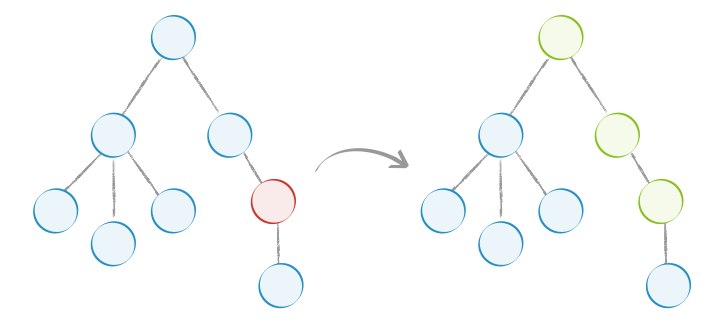

# Immutable.js

## JavaScript数据修改的问题

看一段大家熟悉的代码

```js
const state = {
  str: '千锋教育',
  obj: {
    y: 1
  },
  arr: [1, 2, 3]
}
const newState = state

console.log(newState === state) // true
```

由于js的对象和数组都是引用类型。所以newState的state实际上是指向于同一块内存地址的, 所以结果是newState和state是相等的。

尝试修改一下数据

```js
const state = {
  str: '千锋教育',
  obj: {
    y: 1
  },
  arr: [1, 2, 3]
}
const newState = state

newState.str = '千锋教育H5学院'

console.log(state.str, newState.str)
```

可以看到，newState的修改也会引起state的修改。要解决这个问题，js中提供了另一种修改数据的方式，要修改一个数据之前先制作一份数据的拷贝，像这样

```js
const state = {
  str: '千锋教育',
  obj: {
    y: 1
  },
  arr: [1, 2, 3]
}
const newState = Object.assign({}, state)

newState.str = '千锋教育H5学院'

console.log(state.str, newState.str)
```

我们可以使用很多方式在js中复制数据，比如`…`,  `Object.assign`, `Object.freeze`, `slice`, `concat`, `map`, `filter`,  `reduce`等方式进行复制，但这些都是浅拷贝，就是只拷贝第一层数据，更深层的数据还是同一个引用，比如：

```js
const state = {
  str: '千锋教育',
  obj: {
    y: 1
  },
  arr: [1, 2, 3]
}
const newState = Object.assign({}, state)

newState.obj.y = 2
newState.arr.push(4)

console.log(state, newState)
```

可以看到，当在更改newState更深层次的数据的时候，还是会影响到state的值。如果要深层复制，就得一层一层的做递归拷贝，这是一个复杂的问题。虽然有些第三方的库已经帮我们做好了，比如`lodash`的`cloneDeep`方法。深拷贝是非常消耗性能的。

```js
import { cloneDeep } from 'lodash'

const state = {
  str: '千锋教育',
  obj: {
    y: 1
  },
  arr: [1, 2, 3]
}
const newState = cloneDeep(state)

newState.obj.y = 2
newState.arr.push(4)

console.log(state, newState)
```

## 什么是不可变数据

不可变数据 (Immutable Data )就是一旦创建，就不能再被更改的数据。对 Immutable 对象的任何修改或添加删除操作都会返回一个新的 Immutable 对象。Immutable 实现的原理是持久化数据结构（ Persistent Data Structure），也就是使用旧数据创建新数据时，要保证旧数据同时可用且不变。同时为了避免 deepCopy 把所有节点都复制一遍带来的s性能损耗，Immutable 使用了 结构共享（Structural Sharing），即如果对象树中一个节点发生变化，只修改这个节点和受它影响的父节点，其它节点则进行共享。



## immutable.js的优缺点

**优点：**

- 降低mutable带来的复杂度
- 节省内存
- 历史追溯性（时间旅行）：时间旅行指的是，每时每刻的值都被保留了，想回退到哪一步只要简单的将数据取出就行，想一下如果现在页面有个撤销的操作，撤销前的数据被保留了，只需要取出就行，这个特性在redux或者flux中特别有用
- 拥抱函数式编程：immutable本来就是函数式编程的概念，纯函数式编程的特点就是，只要输入一致，输出必然一致，相比于面向对象，这样开发组件和调试更方便。推荐一本函数式编程的在线免费书《[JS 函数式编程指南](<https://llh911001.gitbooks.io/mostly-adequate-guide-chinese/content/>)》, 此书可以推荐给学生做为课外补充阅读。

**缺点：**

- 需要重新学习api
- 资源包大小增加（源码5000行左右）
- 容易与原生对象混淆：由于api与原生不同，混用的话容易出错。

## 使用Immutable.js

参考[官网](<https://immutable-js.github.io/immutable-js/>)重点讲解数据不可变数据的创建、更新及比较方式 。对于就业班来说，掌握以下知识点即可。

### Map

```js
import { Map } from 'immutable'

const map = Map({
  a: 1,
  b: 2,
  c: 3
})

const newMap = map.set('b', 20) // immutable数据每次都是生成新的再重新调用set进行修改，所以需要 重新赋值给一个新的变量

console.log(map, newMap) // immutable.Map不是原生的对象
console.log(map.b, newMap.b) // immutable.Map不是原生的对象, 所以是undefined
console.log(map.get('b'), newMap.get('b')) // 要取值，需要调用get(key)方法，可以看到，两个值不一样

const obj = {
  a: 1,
  b: 2,
  c: 3
}

console.log(Map.isMap(map), Map.isMap(obj)) // true false, 使用Map.isMap来判断是否是一个immutable.Map类型
```

### List

```js
import { List } from 'immutable'

const list = List([1, 2, 3, 4])
const newList = list.push(5)
console.log(list, newList)
console.log(list[4], newList[4]) // undefined undefined
console.log(list.get(4), newList.get(4)) // undefined 5
console.log(list.size, newList.size) // 4 5

const arr = [1, 2, 3, 4]

console.log(List.isList(list), List.isList(arr)) // true false
```

### equals & is

```js
import { Map, is } from 'immutable'

const map = Map({
  a: 1,
  b: 2,
  c: 3
})

const anotherMap = Map({
  a: 1,
  b: 2,
  c: 3
})

console.log(map == anotherMap) // false
console.log(map === anotherMap) // false
console.log(map.equals(anotherMap)) // 使用equals进行比较 true
console.log(is(map, anotherMap)) // 使用is进行比较 true
```

### List常用api

```js
import { List } from 'immutable'

const list = List([1, 2, 3, 4])
const list1 = list.push(5)
const list2 = list1.unshift(0)
const list3 = list.concat(list1, list2)
const list4 = list.map(v => v * 2)

console.log(list.size, list1.size, list2.size, list3.size, list4.toJS()) // 4 5 6 15, [2, 4, 6, 8]
```

### Map常用api

```js
import { Map } from 'immutable'

const alpha = Map({
  a: 1,
  b: 2,
  c: 3
})
const objKeys = alpha.map((v, k) => k)
console.log(objKeys.join()) // a, b, c


const map1 = Map({
  a: 1,
  b: 2
})
const map2 = Map({
  c: 3,
  d: 4
})
const obj = {
  d: 400,
  e: 50
}

const mergedMap = map1.merge(map2, obj)

console.log(mergedMap.toObject())
console.log(mergedMap.toJS())
```

### 嵌套数据结构

```js
const { fromJS } = require('immutable');
const nested = fromJS({ a: { b: { c: [ 3, 4, 5 ] } } });

const nested2 = nested.mergeDeep({ a: { b: { d: 6 } } });
// Map { a: Map { b: Map { c: List [ 3, 4, 5 ], d: 6 } } }

console.log(nested2.getIn([ 'a', 'b', 'd' ])); // 6

const nested3 = nested2.updateIn([ 'a', 'b', 'd' ], value => value + 1);
console.log(nested3);
// Map { a: Map { b: Map { c: List [ 3, 4, 5 ], d: 7 } } }

const nested4 = nested3.updateIn([ 'a', 'b', 'c' ], list => list.push(6));
// Map { a: Map { b: Map { c: List [ 3, 4, 5, 6 ], d: 7 } } }
```

## 在redux中使用immutable.js

[redux官网](<https://redux.js.org/recipes/using-immutablejs-with-redux>)推荐使用[redux-immutable](<https://www.npmjs.com/package/redux-immutable>)进行redux和immutable的集成。几个注意点：

`redux`中，利用`combineReducers`来合并多个`reduce`, `redux`自带的`combineReducers`只支持原生js形式的，所以需要使用`redux-immutable`提供的`combineReducers`来代替

```js
// 使用redux-immutable提供的combineReducers方法替换redux里的combineReducers
import {combineReducers} from 'redux-immutable'
import reducerOne from './reducerOne'
import reducerTwo from './reducerTwo'
 
const rootReducer = combineReducers({
    reducerOne,
    reducerTwo
});
 
export default rootReducer;
```

`reducer`中的`initialState`也需要初始化成`immutable`类型, 比如一个counter的reducer

```js
import { Map } from 'immutable'

import ActionTypes from '../actions'

const initialState = Map({
  count: 0
})

export default (state = initialState, action) => {
  switch (action.type) {
    case ActionTypes.INCREAMENT:
      return state.set('count', state.get('count') + 1) // 使用set或setIn来更改值, get或者getIn来取值
    case ActionTypes.DECREAMENT:
      return state.set('count', state.get('count') - 1)
    default:
      return state
  }
}
```

`state`成为了`immutable`类型，`connect`的`mapStateToProp`也需要相应的改变

```js
const mapStateToProps = state => ({
  count: state.getIn(['counter', 'count']) // 永远不要在mapStateToProps里使用`toJS`方法，因为它永远返回一个新的对象
})
```

在`shouldComponentUpdate`里就可以使用`immutable.is`或者`instance.equals`来进行数据的对比了。
